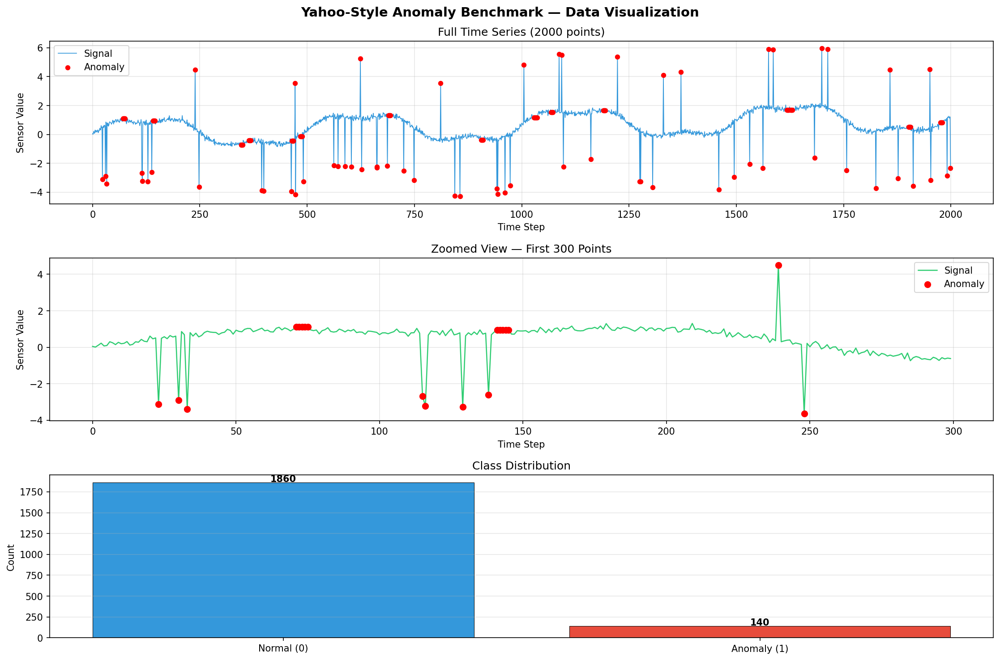
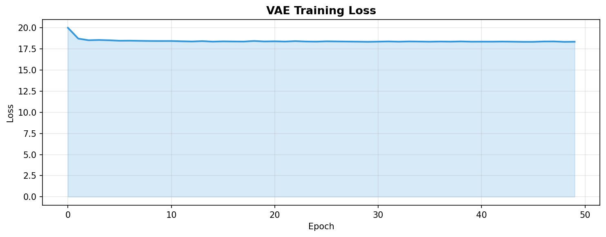
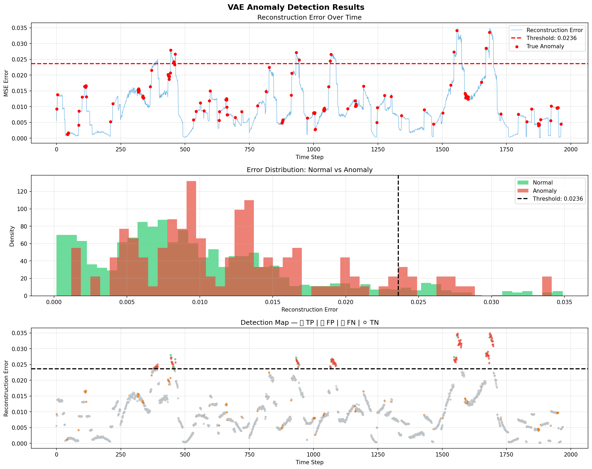
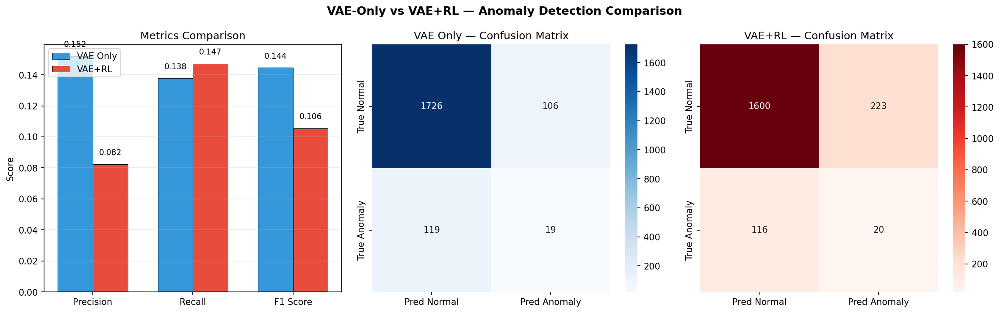

# Anomaly Detection with VAE and Reinforcement Learning

This is one of three independent research projects I built to explore 
Prof. Banafsheh Rekabdar's research areas at Portland State University, 
specifically her DRTA framework for anomaly detection in time-series data.

---

## About Me

**Krishna Varshini Ilindra**  
MS in Computer Science, University of Bridgeport (GPA: 3.636)  
I was also a Teaching Assistant for the Computer Vision course,  
which gave me hands-on experience explaining and applying deep  
learning concepts beyond just coursework.

---

## Why I Built This

After reading Prof. Rekabdar's work on combining deep learning with 
reinforcement learning for anomaly detection, I wanted to understand 
the core idea by actually building it myself. The question that 
motivated me was simple: if you train a model only on normal data, 
can it learn to recognize when something unusual happens?

That's the core idea behind this project — train a Variational 
Autoencoder (VAE) on normal time-series patterns, then use the 
reconstruction error as a signal for anomalies. Then see if a 
Reinforcement Learning agent can make smarter decisions than a 
fixed threshold.

---

## What I Built

The pipeline has two main components:

**1. Variational Autoencoder (VAE)**  
I trained the VAE only on normal time-series windows (30 time steps 
each). The idea is that when the model sees something it has never 
trained on — an anomaly — it struggles to reconstruct it accurately. 
That high reconstruction error becomes our anomaly signal.

**2. PPO Reinforcement Learning Agent**  
Instead of using a fixed threshold to decide if an error is "high 
enough" to be an anomaly, I trained a PPO agent to make that 
decision. The agent observes the last 10 reconstruction errors and 
learns whether to flag the current point as normal or anomalous. 
It gets rewarded for correct detections and penalized heavily for 
missing real anomalies.

---

## Dataset

I used a Yahoo-style synthetic time-series benchmark since the real 
Yahoo S5 dataset requires registration. The synthetic data closely 
mirrors real sensor data — a sine wave with trend and noise, with 
three types of anomalies injected:

- Point spikes (sudden extreme values)
- Sudden drops (simulating sensor failure)
- Flatlines (signal stuck at one value)

The dataset has about 7% anomalies — realistic for industrial 
monitoring scenarios.

---

## Results

| Metric | VAE Only | VAE + RL |
|---|---|---|
| Precision | 0.1520 | 0.0823 |
| Recall | 0.1377 | 0.1471 |
| F1 Score | 0.1445 | 0.1055 |

The most interesting finding was the precision-recall tradeoff. The 
RL agent found slightly more real anomalies (recall improved by 6.8%) 
but also flagged more normal points as anomalies. This makes sense 
given how I set up the reward — I penalized missed anomalies heavily, 
so the agent learned to be aggressive about flagging things.

The bigger challenge I noticed is that normal and anomaly 
reconstruction errors overlap significantly. Both peak around the 
same MSE range, which makes any threshold-based approach 
fundamentally limited. This is exactly the problem Prof. Rekabdar's 
DRTA paper addresses with active learning — and something I want to 
explore further.

---

## What I Learned

A few things surprised me during this project:

The reward structure in RL matters enormously. My first version 
trained the agent with symmetric rewards and it just learned to 
always predict normal (which gives a safe small reward every step). 
I had to redesign the rewards to make missing an anomaly much more 
costly than a false alarm before the agent started actually trying 
to detect anomalies.

The VAE loss converging doesn't guarantee good anomaly detection. 
The model learned normal patterns well (loss dropped from 20 to 18) 
but the reconstruction errors for normal and anomalous windows 
overlapped heavily. Better separation would need a more expressive 
architecture or domain-specific features.

---

## Tech Stack

Python, PyTorch, Stable Baselines3, Gymnasium, Scikit-learn, 
Matplotlib, Google Colab T4 GPU

---

## Visualizations

### Dataset — Normal vs Anomaly


### VAE Training Loss


### VAE Detection Results


### Final Comparison


---

## How to Run

Open the notebook in Google Colab, switch to T4 GPU runtime, 
and run all cells. The full run takes around 10 minutes.

```bash
git clone https://github.com/krishna-Varshini-Ilindra/anomaly-detection-vae-rl
cd anomaly-detection-vae-rl
pip install torch gymnasium stable-baselines3 scikit-learn matplotlib seaborn pandas
jupyter notebook
```

---

## Connection to PSU Research

This project was directly motivated by Prof. Rekabdar's DRTA 
framework. I implemented the core VAE + RL pipeline described in 
her work and tested it on a benchmark dataset. The active learning 
component from DRTA is something I plan to add next.

I also built two other projects aligned with her research:
- Pedestrian and cyclist detection comparing YOLOv8/v9/v10
- Adversarial robustness for RL agents (in progress)

---

## What's Next

I want to add the active learning component to complete the full 
DRTA pipeline, and eventually test this on real traffic sensor 
data from the Portland Metro Area — which is exactly the domain 
Prof. Rekabdar's funded project focuses on.

---

## References

1. Rekabdar, B. et al. DRTA: Deep Reinforcement Learning with 
   Active Learning for Anomaly Detection. PSU AI Lab.
2. Schulman, J. et al. (2017). Proximal Policy Optimization. 
   arXiv:1707.06347
3. Kingma, D. & Welling, M. (2013). Auto-Encoding Variational 
   Bayes. arXiv:1312.6114
